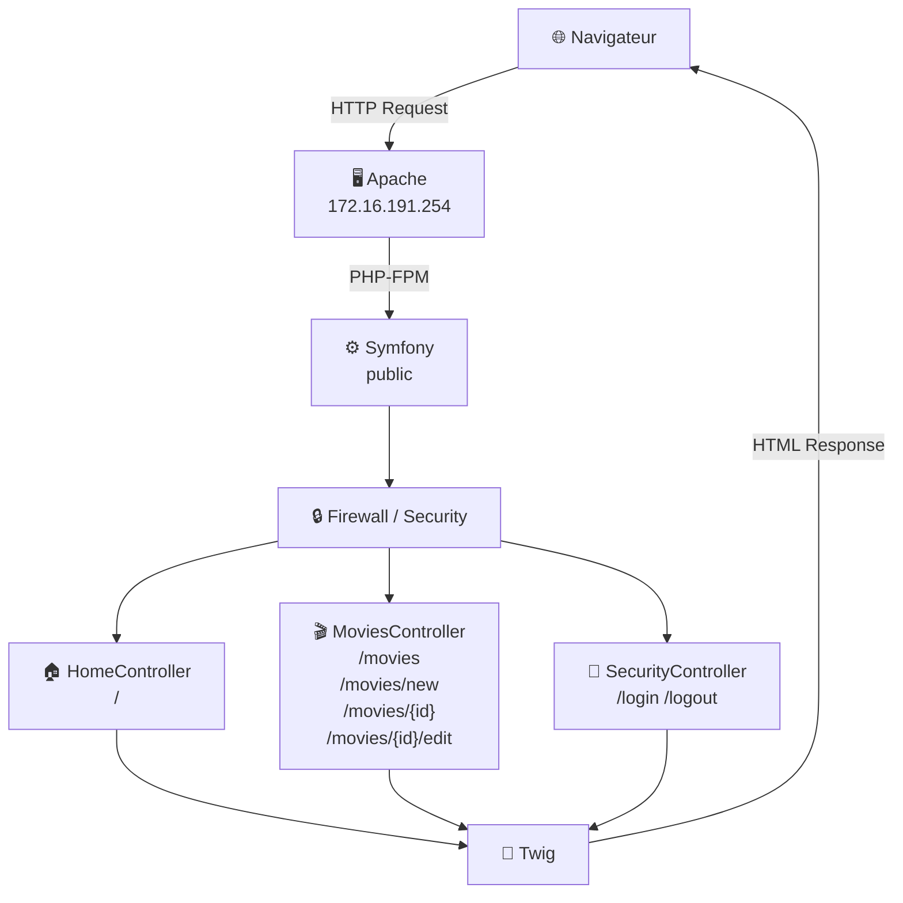
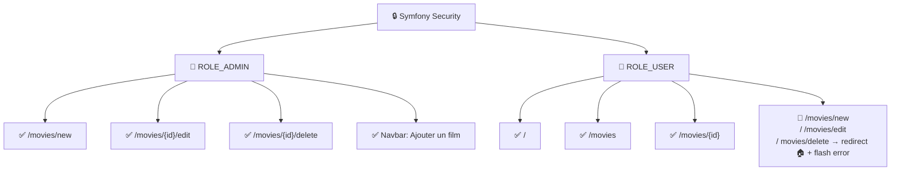

```mermaid
flowchart TD
    Browser["🌐 Navigateur"]
    Apache["🖥️ Apache\n172.16.191.254"]
    Symfony["⚙️ Symfony\npublic"]
    Security["🔒 Firewall / Security"]
    HomeCtrl["🏠 HomeController\n/"]
    MoviesCtrl["🎬 MoviesController\n/movies\n/movies/new\n/movies/{id}\n/movies/{id}/edit"]
    AuthCtrl["🔐 SecurityController\n/login /logout"]
    Twig["🎨 Twig"]

    Browser -->|"HTTP Request"| Apache
    Apache -->|"PHP-FPM"| Symfony
    Symfony --> Security
    Security --> HomeCtrl
    Security --> MoviesCtrl
    Security --> AuthCtrl
    HomeCtrl --> Twig
    MoviesCtrl --> Twig
    AuthCtrl --> Twig
    Twig -->|"HTML Response"| Browser
```

```mermaid
flowchart TD
    Security["🔒 Symfony Security"]
    Admin["👑 ROLE_ADMIN"]
    User["👤 ROLE_USER"]

    AdminNew["✅ /movies/new"]
    AdminEdit["✅ /movies/{id}/edit"]
    AdminDelete["✅ /movies/{id}/delete"]
    AdminNavbar["✅ Navbar: Ajouter un film"]

    UserHome["✅ /"]
    UserMovies["✅ /movies"]
    UserShow["✅ /movies/{id}"]
    UserDenied["🚫 /movies/new\n/ /movies/edit\n/ movies/delete → redirect 🏠 + flash error"]

    Security --> Admin
    Security --> User

    Admin --> AdminNew
    Admin --> AdminEdit
    Admin --> AdminDelete
    Admin --> AdminNavbar

    User --> UserHome
    User --> UserMovies
    User --> UserShow
    User --> UserDenied
```

